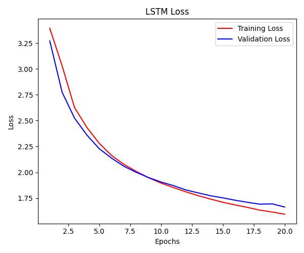
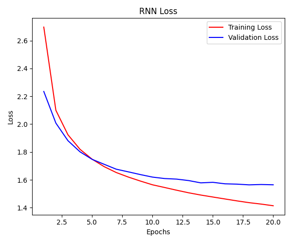
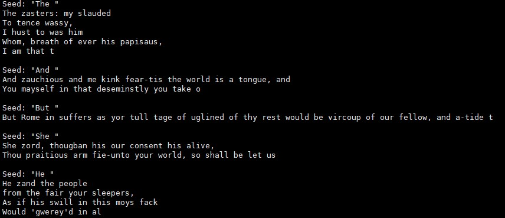
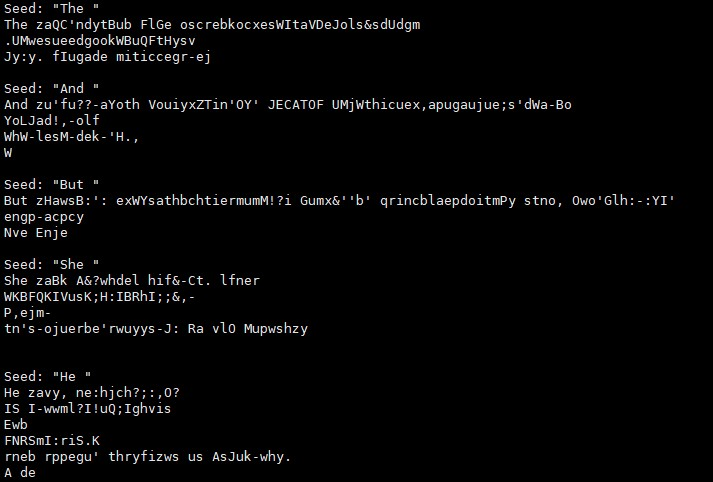
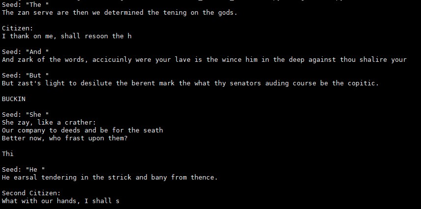

# Language_Modeling_project

This project will work on deep learning networks for character-level language modeling. We compare performance by implementing vanilla RNN and LSTM using the Shakespeare dataset. Afterwards, samples are generated using a model with high performance.

## Code Configuration

- `dataset.py`: Defines a PyTorch dataset class that reads Shakespeare's works from a given text file and creates a character-by-character dataset for language modeling.
- `model.py`: Defines the architectures of vanilla RNN and vanilla LSTM.
- `main.py`: Main script to execute training and testing of the models.
- `README.md`: This file, explaining the project and how to run it.

## How to run it 
```
### code download
git clone https://github.com/SangbeomJeong/

### Train run
CUDA_VISIBLE_DEVICES=0 python main.py

### Generate run 
CUDA_VISIBLE_DEVICES=0 python generate.py
```

# Model Implementations
* For both models, the **hidden size was used as 128, num_layer was set to 4, and the output size was made the same as the input size**.
## Vanilla_RNN:

Layer1 : embedding layer(input_size, hidden_size)

Layer2 : RNN(hidden_size, hidden_size, num_layers, batch_first=True)

Layer3 : FC layer(hidden_size, output_size)

## Vanilla_LSTM:

Layer1 : embedding layer(input_size, hidden_size)

Layer2 : LSTM(hidden_size, hidden_size, num_layers, batch_first=True)

Layer3 : FC layer(hidden_size, output_size)


# Performance Comparison

## Model Performance Summary
### Vanilla_RNN

Training Accuracy: 56.91%
Testing Accuracy: 53.55%
Training Loss: 1.4140
Testing Loss: 1.5644



### Vanilla_LSTM

Training Accuracy: 52.82%
Testing Accuracy: 51.38%
Training Loss: 1.5952
Testing Loss: 1.6645



## Analysis and Discussion
When checking the experimental results, it can be seen that RNN shows better performance on the Shakespeare dataset. So, we want to perform generate.py with the weights learned with RNN.


# Create characters in Shakespeare's text style(generate.py)

## temperature parameter T impact
Let’s check how the results change by adjusting parameter T.

### T == 1
The picture below is the result when T is set to 1. Overall, it can be seen that the generated sentences have a certain level of meaning, but contain unnatural and incomprehensible words. Setting T to 1 means that the model will generate output using the probability distribution of the learned data. The reason why some of the generated sentences are difficult to understand in context can be assumed to be that the existing pretrained weight has a performance of 53.55%, which is not a completely high performance.



### T == 4
The picture below is the result when T is set to 4. The generated sentences are in a completely unrecognizable form. When T is greater than 1, diversity can be increased, resulting in less certain predictions but potentially creative results. However, it produces results that are completely unsuitable for sentence generation tasks.



### T == 0.7
The picture below is the result when T is set to 0.7. Setting T less than 1 means that sentences are generated by increasing events with higher probability relative to other events. As a result of sentence generation, we can see that it clearly produces better sentences than when T is set to 4, but it does not generate perfectly smooth sentences. This can also be assumed to be due to the fact that the existing pretrained weight itself does not show high performance.




